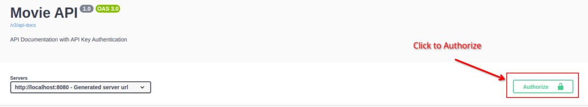

## Movies List Sample App

This project includes some Rest APIs have been provided for a mobile/web application in about movies.<br>

### APIs List

This project includes 3 API:

- Search Movies
- Popular Movies
- Get movie by ID

### APIs Documentation

The APIs of this project have been documented using `Swagger`.<br>
You can access it on this link in you local system:<br>
`http://localhost:8080/swagger-ui/index.html`

### Data set

Data set for this project has been generated by AI and almost is real (except poster urls).<br>
In order to have test data when you deploy the project, they will be inserted to db using flyway.<br>
The selected database for this project is `PostgreSQL`.

### Database Schema
There are 3 tables here.
- `movies`: includes movies list
- `api_keys`: includes list of all valid api keys
- `flyway_schema_history`: history of data migrations have been applied by flyway

In this version, considered only one Genres for each movie. 
If we wanted multiple Genres per movie or dynamic Genres, we would need two more tables:
- `genres`: to keep list of all defined genres
- `genres_mapping`: to map genres to movies by ids

### Authentication

In this project we used API key authentication. <br>
Access to all Rest APIs requires a valid API Key.<br>
To Authorize in Swagger UI, click on the `Authorize` key on top right part of swagger ui.



### Setup the project

To Simplify the project setup, `Dockerfile` and `docker-compose.yaml` files have been provided.
the only needed steps to deploy the project are:

- Clone the project:<br>

```shell
git clone https://github.com/rezayi/MoviesListSampleApp.git
```

<br>or to clone by ssh key as bellow:<br>

```shell
git clone git@github.com:rezayi/MoviesListSampleApp.git
```

- Move to project directory:<br>

```shell
cd MoviesListSampleApp
```

- Start docker compose:<br>

```shell 
sudo docker-compose up --build
```

- If you don't have installed `docker-compose` on your system you can install it this way:<br>
```shell
sudo snap install docker
```

### Demo
The project has been deployed on this address:<br>

http://194.5.192.219/swagger-ui/index.html

#### Note: 
Accessing to APIs requires API key.
[Email me](mailto://m.rezayi69@gmail.com), if you need it.